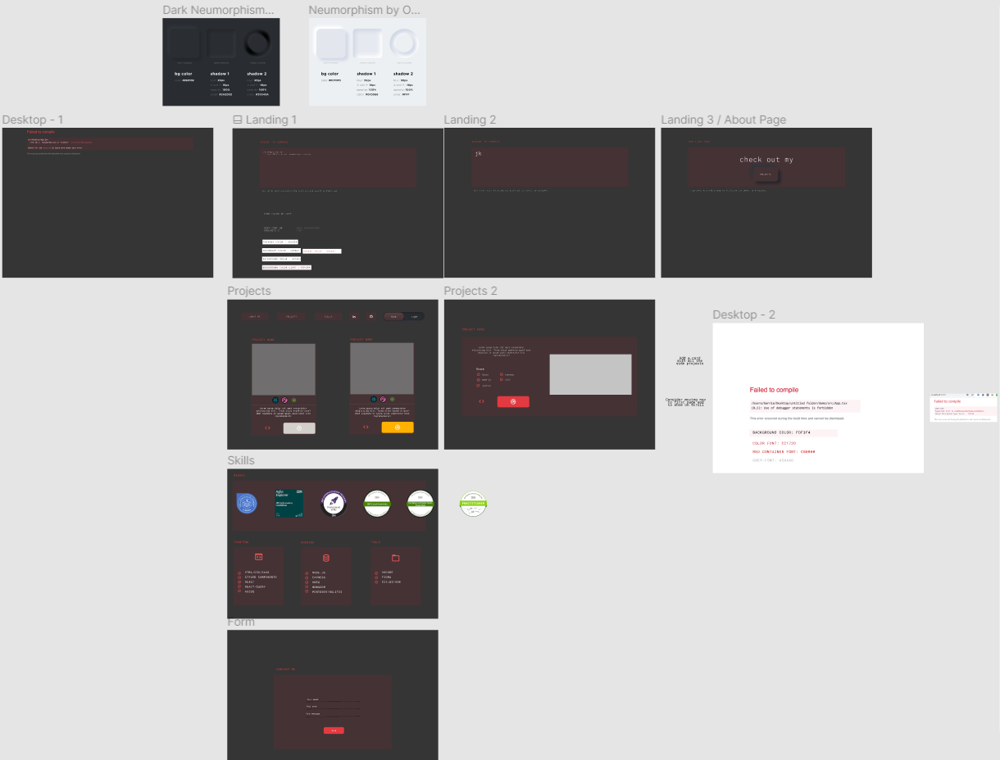
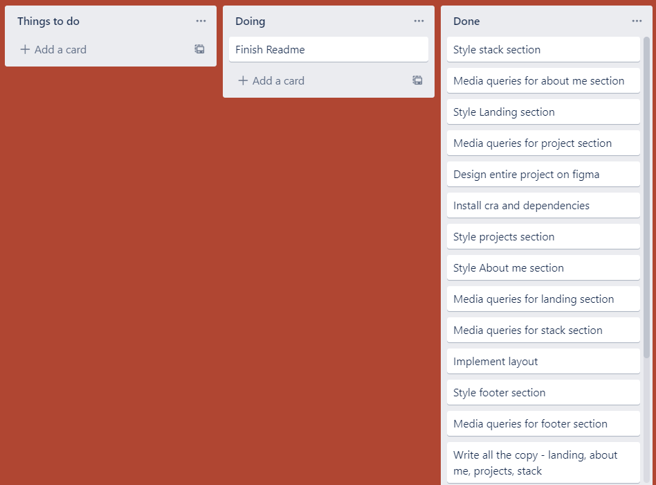
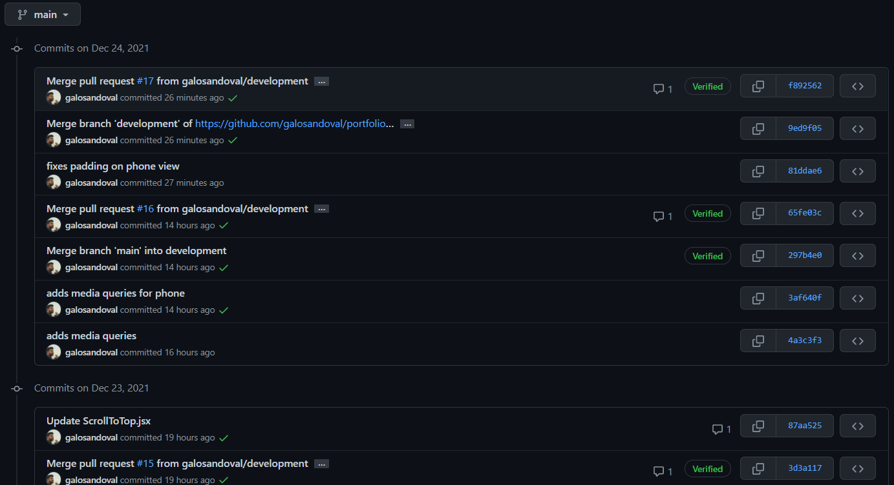

# Portfolio by Galo Sandoval

## How I worked on this project

My goal was to simulate a professional work environment

- I built this web app based on figma designs, although the designs changed quite a bit when after I began making the site:
  
- I worked with tasks on a Kanban board:
  
- I used detailed commits and pushed to a development branch:
  

## How to navigate this project

- I didn't use too much state management on this project so useState was my go to: https://github.com/galosandoval/portfolio/blob/main/src/components/Skills/Skills.jsx#L23
- Responsive CSS using styled-components: https://github.com/galosandoval/portfolio/blob/main/src/components/Skills/Skills.styles.jsx#L133
- Custom hooks include useDarkMode and UseObserver (Intersection Observer): https://github.com/galosandoval/portfolio/tree/main/src/utils

### Directory layout

    .
    ├── public                  
    ├── src 
    |   |-- assets                   # Design files
    |   |-- components
    |       |-- AboutMe              # Each contain a component and styles
    |       |-- ContactMe
    |       |-- Footer
    |       |-- Landing
    |       |-- Navigation
    |       |-- Projects
    |       |-- Skills
    |   |-- styles                   # Shared styles and globals styles
    |   |-- utils                    # Helper functions and hooks
    |   |-- index.js       
    ├── LICENSE
    └── README.md

## Why I built the project this way

- I didn't need a state management library like redux. For this app 'useState' was sufficient. 
- Styled components is a great library for styling. Out of the box, it includes auto-prefixes, uses scoped classes, and integrates nicely with JS.
- The whole point of this project is to display my projects in a simple and elegant way so.

## Available scripts

```
npm start
```